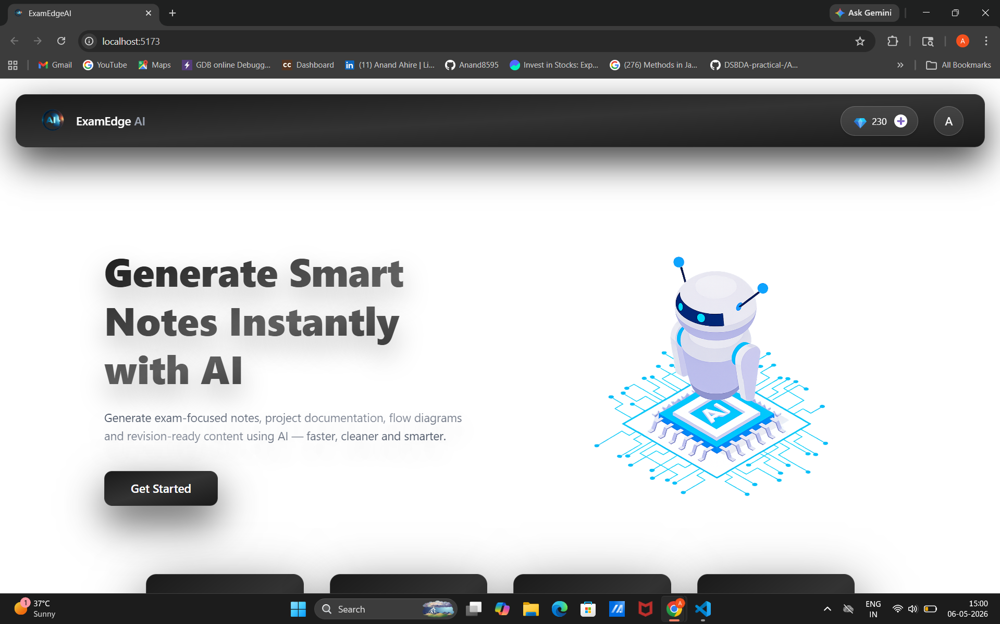

# ExamEdges AI
AI-Powered Learning and Notes Generation Platform

---
## Overview
ExamEdges AI is a full-stack web application that enables users to generate intelligent notes using AI. 
It improves learning efficiency through automation, secure authentication, and a responsive user interface.

---
## Live Demo
https://ai-mern-project.vercel.app

---

## Demo Video
Watch on LinkedIn:
https://www.linkedin.com/posts/anand-ahire-142519307_mern-ai-webdevelopment-ugcPost-7456694471037140992-aiH1

---

## Screenshots
### Dashboard


### Login Page


### Notes Generate Page


### Notes History


### Payment Page


---

## Features
* User Authentication (Login / Signup / Google)
* AI-based Notes Generation
* Notes History Management
* Download Notes Feature
* Payment Integration
* Responsive Design

---

## Tech Stack
* Frontend: React.js, Tailwind CSS
* Backend: Node.js, Express.js
* Database: MongoDB
* AI Integration: Gemini API
* Authentication: JWT and Google OAuth

---

## Project Structure
```bash
ExamEdges-AI/
│── client/
│── server/
│── models/
│── routes/
│── controllers/
│── middleware/
```

---

## Installation and Setup
### Clone Repository
```bash
git clone https://github.com/Anand8595/ai-mern-project.git
cd ai-mern-project
```

### Backend Setup
```bash
cd server
npm install
npm start
```

### Frontend Setup
```bash
cd client
npm install
npm run dev
```

---

## Environment Variables
Create a `.env` file in the server directory and add:
MONGO_URI=your_mongodb_uri
JWT_SECRET=your_secret_key
GEMINI_API_KEY=your_api_key

---

## Contact
- LinkedIn: https://www.linkedin.com/in/anand-ahire-142519307  
- Email: anandsahire8595@gmail.com  

---

## Conclusion
This project demonstrates full-stack development using the MERN stack along with AI integration. 
It highlights skills in building scalable applications, secure authentication systems, and integrating third-party AI services, 
making it suitable for real-world applications and placement portfolios.
